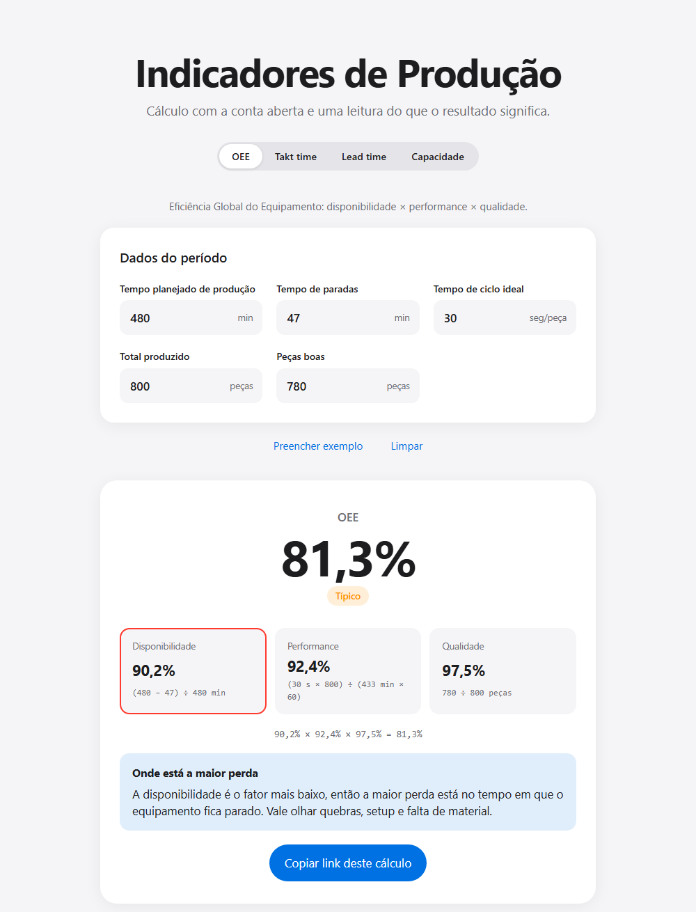

# Indicadores de Produção

Calculadora de indicadores de produção que mostra a conta de cada resultado e explica o que ele significa. Calcula OEE, takt time, lead time e capacidade produtiva.

**Acesse:** https://gutemberg-vercosa.github.io/calculadora-indicadores-producao/

## O que ela faz

- Mostra a conta com os valores preenchidos, para ficar claro de onde vem cada número.
- Interpreta o resultado e sugere onde agir.
- Guarda os valores no link, então dá para compartilhar um cálculo.

### OEE

- Calcula Disponibilidade, Performance, Qualidade e o OEE final.
- Aponta o fator mais baixo e o que costuma causar esse tipo de perda.
- Classifica o resultado em faixas de referência (baixo, típico, classe mundial).

### Takt time

- Calcula o ritmo necessário para atender a demanda diária.
- Com o tempo de ciclo atual (opcional), mostra a capacidade por dia e quanto do takt o ciclo ocupa.
- Quando o ciclo não atende, mostra quantas peças faltam e o que mudar: reduzir o ciclo, dividir em postos ou aumentar o tempo disponível.

### Lead time

- Calcula quanto tempo uma peça leva do início ao fim do processo, em dias e em horas de trabalho.
- Com o tempo de agregação de valor (opcional), mostra a eficiência do fluxo e quanto do lead time é espera.
- Mostra quanto o lead time cai ao reduzir o estoque em processo.

### Capacidade produtiva

- Calcula a capacidade teórica e a capacidade efetiva por mês, descontando a eficiência (OEE).
- Mostra quantas peças a eficiência deixa de entregar.
- Com a demanda mensal (opcional), mostra a utilização e, se não atender, o OEE, o número de turnos ou o tempo de ciclo necessários.

## Fórmulas

### OEE

| Fator | Fórmula |
|---|---|
| Disponibilidade | (tempo planejado − paradas) ÷ tempo planejado |
| Performance | (tempo de ciclo ideal × total produzido) ÷ tempo operando |
| Qualidade | peças boas ÷ total produzido |
| **OEE** | Disponibilidade × Performance × Qualidade |

### Takt time

| Indicador | Fórmula |
|---|---|
| Tempo disponível | (duração do turno − pausas) × turnos por dia |
| **Takt time** | tempo disponível ÷ demanda diária |
| Capacidade | tempo disponível ÷ tempo de ciclo atual |
| Ocupação do takt | tempo de ciclo atual ÷ takt time |

### Lead time

| Indicador | Fórmula |
|---|---|
| **Lead time** | estoque em processo ÷ produção diária (Lei de Little) |
| Eficiência do fluxo | tempo de agregação de valor ÷ lead time |
| Tempo em espera | lead time − tempo de agregação de valor |

### Capacidade produtiva

| Indicador | Fórmula |
|---|---|
| Capacidade teórica | postos × horas por turno × 3.600 ÷ tempo de ciclo × turnos × dias |
| **Capacidade efetiva** | capacidade teórica × OEE |
| Utilização | demanda mensal ÷ capacidade efetiva |

## Tecnologias

HTML, CSS e JavaScript puro, sem dependências. Layout mobile first, com tema claro e escuro automático. Publicado com GitHub Pages.

## Rodando localmente

Basta abrir o `index.html` no navegador.

